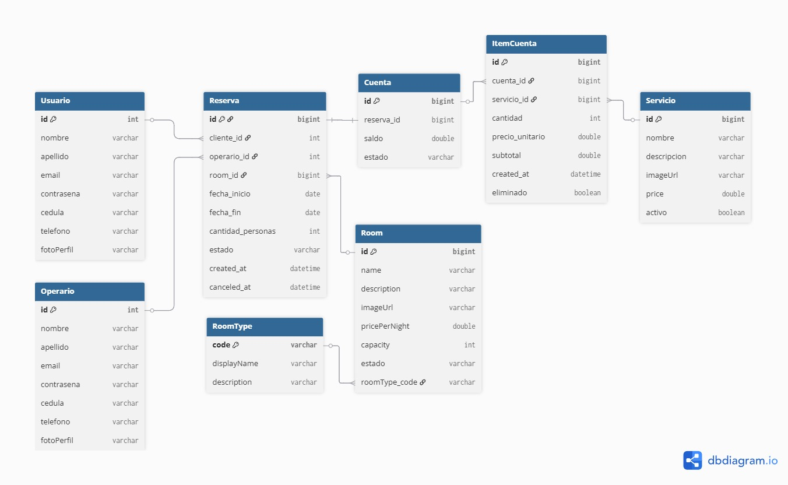
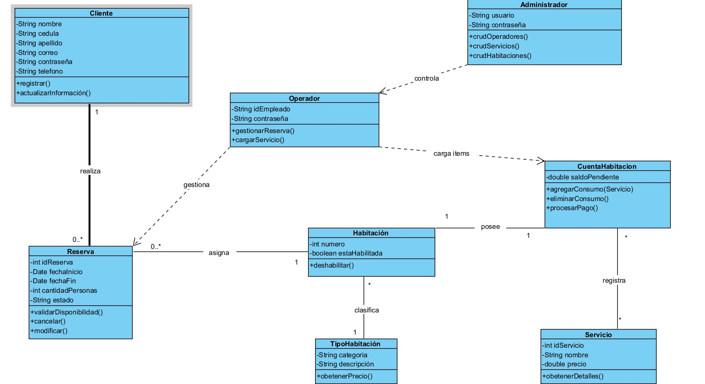

# Mira Mar Caribbean Luxury 🌊

**Mira Mar** es una plataforma integral de gestión para un resort boutique de lujo. El sistema no solo ofrece una interfaz elegante para los huéspedes, sino que incluye un robusto panel administrativo para la gestión de inventario, servicios y control de usuarios.


## 📋 Módulos del Sistema

### 🔐 Seguridad y Acceso
- **Autenticación:** Sistema de Login personalizado con validación de credenciales.
- **Registro:** Creación de cuentas para nuevos clientes con interfaz moderna (Tailwind CSS).
- **Roles y Permisos:** Diferenciación clara entre **Administradores** (gestión total) y **Clientes** (reservas).

### 🏨 Gestión de Suites (CRUD)
- Visualización de catálogo con precios por noche y capacidad.
- Administración de habitaciones: creación, edición y eliminación desde tablas dinámicas.
- Detalle de habitación con galería de imágenes y resumen de costos.

### 🍽️ Experiencias y Servicios
- Catálogo de servicios adicionales (Spa, Tours, Restaurante).
- Sistema de reserva de servicios con selección de fecha, hora y número de personas.

### 👥 Administración de Usuarios
- Panel de control para gestionar perfiles de usuarios.
- Visualización detallada de información de contacto y roles asignados.

## 🛠️ Stack Tecnológico

* **Backend:** Java 17 + Spring Boot.
* **Frontend:** * **Thymeleaf:** Motor de plantillas dinámicas.
    * **Estilos:** CSS3 nativo, **Tailwind CSS** (Registro) y **Bootstrap 5** (Login).
    * **JS:** Lógica interactiva y manipulacion del DOM.
* **Iconografía:** [Phosphor Icons](https://phosphoricons.com/) & FontAwesome.
* **Base de Datos:** H2 / MySQL (vía Spring Data JPA).

## 🗄️ Arquitectura de Datos
- El siguiente diagrama entidad–relación representa la estructura de la base de datos utilizada en el sistema **Mira Mar Caribbean Luxury**, mostrando las principales entidades como usuarios, reservas, habitaciones, servicios, cuentas y pagos.

### Modelo Entidad–Relación


### Diagrama De Clases



## 📂 Estructura del Proyecto

Basado en la arquitectura MVC (Modelo-Vista-Controlador):

```text
src/main/java/com/miramar/
├── controller/       # Manejo de rutas (Rooms, Services, Auth, Users)
├── model/            # Entidades de base de datos
├── repository/       # Interfaces de JPA para persistencia
└── service/          # Lógica de negocio

src/main/resources/
├── templates/        # Vistas .html (Thymeleaf)
│   ├── fragments/    # Navbar y Footer reutilizables
│   ├── rooms/        # Gestión de suites
│   ├── HotelServices/# Gestión de experiencias
│   └── Usuarios/      # Gestión de perfiles
└── static/           # Recursos (CSS, JS, Imágenes)
   git clone [https://github.com/Andres-devp/Mira-Mar.git](https://github.com/Andres-devp/Mira-Mar.git)
